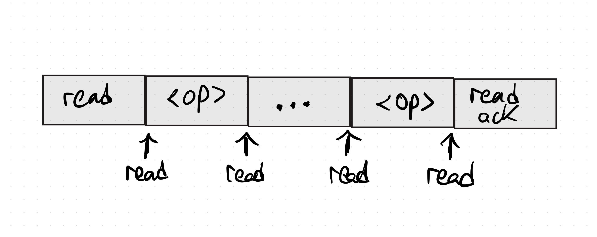
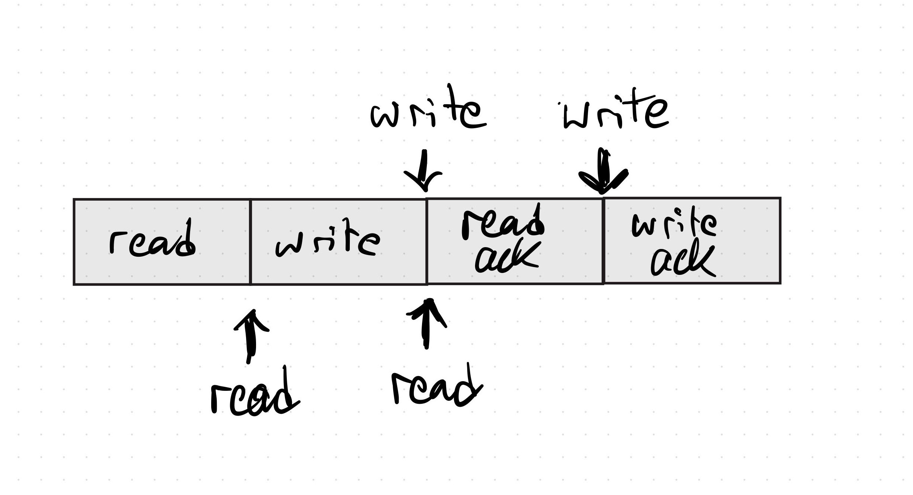

+++
title = "Using TLA+ to check if a history is linearizable"
+++

I was inspired by an old post from Kyle Kingsbury, aphyr, on Knossos [Redis and
linearizability](https://aphyr.com/posts/309-knossos-redis-and-linearizability),
which I recommend reading. In it, he gathers histories of client read and write
results to check whether a hypothetical protocol would be linearizable. Quoting
directly from the article:

> To verify the history, we need a model which verifies that a sequence of operations applied in a particular order is valid. For instance, if we’re describing a register (e.g. a variable in a programming language–a mutable reference that points to a single value), we would like to enforce that every read sees the most recently written value. If we write 1, then write 2, then read, the read should see 2.
>
> <footer><a href="https://aphyr.com/posts/309-knossos-redis-and-linearizability#knossos">https://aphyr.com/posts/309-knossos-redis-and-linearizability#knossos</a></footer>

In the rest of the post Kyle builds a state explorer that works by testing all
possible combinations of histories against the register _model_ defined above.
The exploration continues until a series of events in the _abstract protocol_
is found which proves that the no implementation of the protocol would be ever
linearizable!

This all can be translated to TLA+ parlance almost one to one by defining a spec
for the _asbtract protocol_ and using
_a refinement mapping_ to see
For more information of refinement see the chaper in the excelent
<cite>Specifying Systems</cite> book by Lamport.
 that our client histories correspond to valid
behaviors of the model.

Thus, in this post I want to explore the same ideas about histories and models
but from a different perspective: by writing TLA+ models that will do the work
for us. By using a high level language that is very general and flexible, we
can learn about state exploration, models and histories from a different angle.

# What does Knossos (Kyle's model checker) do in theory?
As I explained briefly, what we are most interested in is taking histories
of reads/writes and seeing if they _conform_ to the model. That is, we want to
verify that the model _could have produced_ the given history of observations.
Consequently, if the model is a single atomic object where all reads and
modifications happen serially, our history is linearizable by definition.

What does _conform to the model_ mean exactly? It means that we let the model
run wild changing its internal state as long as it serves the reads and writes
that we observed in the correct order. That is, if a client asks to read a
value and gets back an ack, the model could serve the read at any point
**after** the request was sent but **before** the response was received. This
is crucial as it limits the window of time where each operation can take place.



You can extend the idea to multiple operations in a straightforward way. Let's
take the folowing history as an example:
```
1. [a] read
2. [b] write
3. [a] read ack
4. [b] write ack
```
The model could have executed the following orderings:



How do we know which of them, if any, are valid? Because the acks carry values
which rule out many possilibities. For example, if `b` writes the value `foo`
and the `a` reads `bar`, we know the read **cannot have happened** after the
write as it would have seen the value `foo`. By combining all the observations
we can rule out all the orderings where the observations are not consistent
with our model. If and only if at least one ordering is left at the end then
our history of observations if linearizable.

# Our own linearizable model in TLA+

I will take the liberty to change slightly the model in Kyle's post: instead of
implementing a single read/write register, I will implement an append-only list
For the same reasons Aphyr choose to use it when implementing Elle. See <cite>Elle: Inferring Isolation Anomalies from Experimental
Observations</cite>.
 which has no duplicate elements.

By using a list, every time we read we get the complete collection of
modifications in the _order_ they were performed. For example if I read an get
back `[4,2]` I know `4` was pushed first followed by `2` and **no other writes
took place**, not in-between, not before and not after. We can then
exhaustively explore the model instead of relying on random behaviors, because
once the list diverges from expected we know we cannot get back to a good
state. Compare it to using a write register where we have two observations:
`read=1` followed by `read=2`. There are infinitely many events that
could have happened in between this two:
```
1. write=1
2. read=1
3. write=foo
// Any number of events can happen here as the value
// is overwritten before it is read.
4. write=2
5. read=2
```

In TLA+, an append only list is very easy to model, we just need two operations:

```tlaplus
--------------------------------- MODULE list -------------------------------
EXTENDS Naturals, Sequences, FiniteSets

CONSTANT Values

VARIABLE primary

Init == primary = <<>>

Read == primary

Push(x) == primary' = Append(primary, x)

Next ==
    LET
     added == { primary[i] : i \in DOMAIN primary }
    IN
     \E x \in Values \ added : Push(x)

Spec == Init /\ [][Next]_<<primary>>
=============================================================================
```

As simple as that. Note that our semantics for `Next` dictate that each valid
behavior of this spec is one where each value in the list is unique!

# How to verify the trace
Ok, we have a model now, but how do we verify our history of observations
against it? We need to keep track of two things:
* `pending` operations, i.e. requests that have been sent but for which no
  response (ack) has been yet received.
* The portion of the history we have already consumed.

In every step, we can either:
* Pop from the trace and put the operation into `pending`. When finding
  responses (acks) we need to make sure we have already executed the
  corresponding request.
* Execute an operation queued in `pending` against the model.

Exploiting TLC's state exploration capabilities we can check all possible
interleavings easily. Let's see first the `Next` predicate which will give us a pretty
good idea of how each action is executed
The TLA model is more general than what was described as it supports histories
from multiple client processes which may interleave arbitrarily, i.e. there is
no synchronization among clients, which is why `Next` can choose any process.
:

```tlaplus
\* Note: When no further events can be executed, Next is disabled.
Next ==
    \E p \in Processes :
        \/ ConsumeTrace(p)
        \/ \E id \in DOMAIN pending[p] : ConsumePending(p, pending[p][id]) /\ UNCHANGED <<counter>>
```

Our traces are just JSON records that contain a field to identify the pair
request/response and either the value to append or the value that was read.
The following is an example:
```json
{"type":"Push","id":1,"value":2}
{"type":"PushFinished","id":1}
{"type":"Read","id":2}
{"type":"ReadFinished","id":2,"value":[1,2]}
{"type":"Read","id":3}
{"type":"Read","id":4}
{"type":"ReadFinished","id":3,"value":[1,2]}
...
```

As explained above the first action will read from the trace and will add the
operation to the `pending` list:
```tlaplus
\* Add the event to the queue of pending events for the process p.
AddPending(p, event) ==
    LET newPendingP == [i \in DOMAIN pending[p] \cup {event.id} |-> IF i = event.id THEN event ELSE pending[p][i]]
    IN pending' = [pending EXCEPT ![p] = newPendingP]

\* Consume an event from the queue by executing it in the abstract model.
ConsumePending(p, event) ==
    /\ \/ /\ event.type = "Push"
          /\ Lst!Push(event.value)
       \/ /\ event.type = "Read"
          \* Look for the associated ReadFinished event to find the data that will be returned.
          /\ LET ids == { i \in DOMAIN Traces[p] : Traces[p][i].id = event.id /\ Traces[p][i].type = "ReadFinished" }
                 values == { Traces[p][i].value : i \in ids }
             IN /\ Assert(Cardinality(values) = 1, "values cannot be != 1")
                \* Check that we could have read this value from the append-only list.
                /\ \E v \in values : v = Lst!Read
          /\ UNCHANGED <<primary>>
    /\ LET newPendingP == [k \in DOMAIN pending[p] \ {event.id} |-> pending[p][k]]
       \* Remove the event from pending.
       IN pending' = [pending EXCEPT ![p] = newPendingP]
```
As you can see from the code above and the comments explaining it, every time
we "execute" a Push operation we will append a value to the list and every time
we "execute" a Read operation we check that we can actually read that value
from the list. If the value is different than what we expect to read then we
cannot execute this event _right now_. TLA will look for other states and try
again later, if there are no other states it means this behavior cannot be
linearizable and will be discarded, the exploration will continue from a past
point.

The second piece is where we consume the trace and move the counters:
```tlaplus
\* Consumes the next event from the trace and adds it to pending.
ConsumeTrace(p) ==
    /\ counter[p] <= Len(Traces[p])
    /\ counter' = [counter EXCEPT ![p] = @ + 1]
    /\ LET event == Traces[p][counter[p]]
       IN
        \/ event.type \in {"Push", "Read"} /\ AddPending(p, event) /\ UNCHANGED <<primary>>
        \* We cannot consume a response (ack) if the request is still not
        \* executed.
        \/ /\ event.type \in {"PushFinished", "ReadFinished"}
           /\ Cardinality({id \in DOMAIN pending[p] : id = event.id}) = 0
           /\ UNCHANGED <<primary, pending>>
```
The most important bit here is that if we find a ReadFinished or PushFinished
event the corresponding Read or Push needs to have been executed already, else
it is not a valid behavior.

Lastly, as you can see from the definition of our model, it tolerates arbitrary
network reorderings as the confirmation for a subsequent operation may come
before a prior one. However, the traces are expected to contain all the
responses, and no message loss is tolerated. I will get back to this point and
explain it in more depth in [Things I have glossed over](#things-i-have-glossed-over).

# Verifying that the trace is linearizable
This is the most tricky part to express in TLA+ as it requires understanding how
TLA+ executes invariants and what refinement is. We would like to know two
things:
1. Does the behavior we execute when doing `Lst!Read` and `Lst!Push` correspond
   to a valid behavior of our `List` model?
2. Have we consumed the whole trace and executed all events?

We can verify 1. by asking TLC to check the property that `[](Spec =>
Lst!Spec)` which means that any behavior of our `Trace` spec corresponds to a
behavior of our `List` spec
Informally, our `Trace` specifies how multiple variables change including
`primary` which is the the only variable `Lst!Spec` is concerned about; it is
oblivious to all others. So the property is equivalent to saying: "verify that
every time `primary` changes it follows `Spec!Next`".
.

In our model, we can specify
The avid reader may be asking themselves of what use is to check the refinement
when we only use the Push and Read operations which seem to always create a
valid behavior. Leaving aside the generality of checking refinement in more
complex specs, there are invalid behaviors of our list that are not detected
unless we check it: whether a value is duplicated in the list; Push does not
restrict it, only `Next` does.
:
```tlaplus
Refinement == Lst!Spec
```

And in the configuration we can ask TLC to check the property:
```
PROPERTY Refinement
```

Now, for point 2. we have to get a little bit more creative. TLC is really
designed to generate all behaviors and check that they satisfy properties, it
does not offer out of the box a capability for seeing _if a single behavior
that satisfies X exists_. Fortunately, we can still use a standard invariant
for that use-case. If such a behavior is found then the invariant will be
violated and the list of states leading to it will be printed. In our case, the
invariant should check that the behavior has not exhausted `pending` and the
traces:
```tlaplus
\* Trigger when all processes have consumed their traces and there are not
\* events queued in pending.
Finished == ~(\A p \in Processes : counter[p] > Len(Traces[p]) /\ Cardinality(DOMAIN pending[p]) = 0)
```
Then simply add the invariant to the configuration:
```
INVARIANT Finished
```

# Putting it all together
We have:
1. Defined a model of an append-only list of unique elements that is
   linearizable.
2. We have used TLA to read the traces and to check all interleavings of
   operations, discarding the invalid ones as soon as the prefix is invalid. We
   have accomplished this by translating client requests to operations in our
   model.
3. We ask TLC to check that the execution of our observations correspond to a
   valid behavior of the list model.
4. Lastly, we ask TLC to find _a single_ behavior that produces the complete
   history. If it is found it means our history is linearizable, if it is not
   it means there is no possible linearization!

# Things I have glossed over
In a real system experiencing network faults, not only are we going to observe
message delays, we are also going to observe message loss. The problem losing
the response is that we are not sure whether the operation was executed
successfully or not for an **unbounded time**. We would need to check all
interleavings of all histories into the future with this operation. This makes
the amount of states explode and TLC will never finish checking them. The
solution is to rely on some bound on the network and have the client log that
an operation failed after a time `t` passes such that it is greater than our
bound on message transmission.

Now that we mention real time, it is also a good time to wonder if we should
model real time into our spec. Adding it would make the model harder to check
as that state space will grow enormously and for seemingly no benefit. If we
can ensure the client will add the necessary marks when a response is not
delivered then modelling real time will not change which behaviors are
admitted/rejected. This is not valid the moment we introduce a more complex
model were reasoning about time is advantageous and we have constraints like
"10s after issuing a successful Push request it will be executed".

The next question is what is the practicality of this approach? how long can
the histories be? The answer is that it depends on the model and the histories
themselves
If all reads/writes are answered immediately and there is no reorderings in the
network then the model checker will only be adding one event at a time to a
single behavior which makes checking it trivial. In general the number of
concurrent behaviors the model checker tracks depends on the number of
`pending` operations.
. For a more formal explanation of the problem that explores it from a
completely different perspective: finding anomalies instead of finding a
linearlizable order; see the excelent paper <cite>Elle: Inferring Isolation
Anomalies from Experimental Observations</cite> which also has a section
comparing itself to model checkers and (spoiler alert!) it is much more
performant.

# Complete spec
For completeness below you will find the complete spec with all the gory
details:
```tlaplus
--------------------------------- MODULE trace ------------------------------
EXTENDS Naturals, Sequences, FiniteSets, TLC, Json

--------------------------------- MODULE list -------------------------------
EXTENDS Naturals, Sequences, FiniteSets

CONSTANT Values

VARIABLE primary

Init == primary = <<>>

Read == primary

Push(x) == primary' = Append(primary, x)

Next ==
    LET
     added == { primary[i] : i \in DOMAIN primary }
    IN
     \E x \in Values \ added : Push(x)

Spec == Init /\ [][Next]_<<primary>>
=============================================================================

CONSTANT Values
CONSTANT Processes

Traces == [p \in Processes |-> JsonDeserialize("traces/" \o p \o ".json")]

\* Trace is well-formed.
ASSUME \A p \in DOMAIN Traces :
    LET trace == Traces[p]
    IN \A i \in DOMAIN trace :
        LET sameIdsI == {j \in DOMAIN trace : trace[i].id = trace[j].id}
            types == {trace[k].type : k \in sameIdsI}
        \* There are always two events for the same id and they are a pair of
        \* read+ack or write+ack.
        IN /\ Cardinality(sameIdsI) = 2
           /\ \/ types = {"Read", "ReadFinished"}
              \/ types = {"Push", "PushFinished"}

VARIABLE primary

Lst == INSTANCE list

VARIABLE counter
VARIABLE pending

Init ==
    /\ counter = [p \in Processes |-> 1]
    /\ pending = [p \in Processes |-> [id \in {} |-> {}]]
    /\ Lst!Init

AddPending(p, event) ==
    LET newPendingP == [i \in DOMAIN pending[p] \cup {event.id} |-> IF i = event.id THEN event ELSE pending[p][i]]
    IN pending' = [pending EXCEPT ![p] = newPendingP]

ConsumePending(p, event) ==
    /\ \/ /\ event.type = "Push"
          /\ Lst!Push(event.value)
       \/ /\ event.type = "Read"
          \* Look for the associated ReadFinished event to find the data returned.
          /\ LET ids == { i \in DOMAIN Traces[p] : Traces[p][i].id = event.id /\ Traces[p][i].type = "ReadFinished" }
                 values == { Traces[p][i].value : i \in ids }
             IN Assert(Cardinality(values) = 1, "values cannot be != 1") /\ \E v \in values : v = Lst!Read
          /\ UNCHANGED <<primary>>
    /\ LET newPendingP == [k \in DOMAIN pending[p] \ {event.id} |-> pending[p][k]]
       IN pending' = [pending EXCEPT ![p] = newPendingP]

ConsumeTrace(p) ==
    /\ counter[p] <= Len(Traces[p])
    /\ counter' = [counter EXCEPT ![p] = @ + 1]
    /\ LET event == Traces[p][counter[p]]
       IN
        \/ event.type \in {"Push", "Read"} /\ AddPending(p, event) /\ UNCHANGED <<primary>>
        \/ /\ event.type \in {"PushFinished", "ReadFinished"}
           /\ Cardinality({id \in DOMAIN pending[p] : id = event.id}) = 0
           /\ UNCHANGED <<primary, pending>>

Next ==
    \E p \in Processes :
        \/ ConsumeTrace(p)
        \/ \E id \in DOMAIN pending[p] : ConsumePending(p, pending[p][id]) /\ UNCHANGED <<counter>>

Spec == Init /\ [][Next]_<<primary, counter, pending>>

Refinement == Lst!Spec
Finished == ~(\A p \in Processes : counter[p] > Len(Traces[p]) /\ Cardinality(DOMAIN pending[p]) = 0)
GreedyConsumeTrace ==
    \* Speed up model checking by reducing redundant states.
    (\E p \in Processes : counter[p] <= Len(Traces[p]) /\ Traces[p][counter[p]].type \in {"Read", "Push"}) => (counter' # counter)

=============================================================================
```

and the corresponding example configuration:
```
CONSTANTS
    Values = {1, 2, 3, 4, 5, 6, 7, 8, 9, 10}
    Processes = {"p1", "p2"}

CHECK_DEADLOCK FALSE

PROPERTY Refinement
INVARIANT Finished
ACTION_CONSTRAINT GreedyConsumeTrace

SPECIFICATION Spec
```
